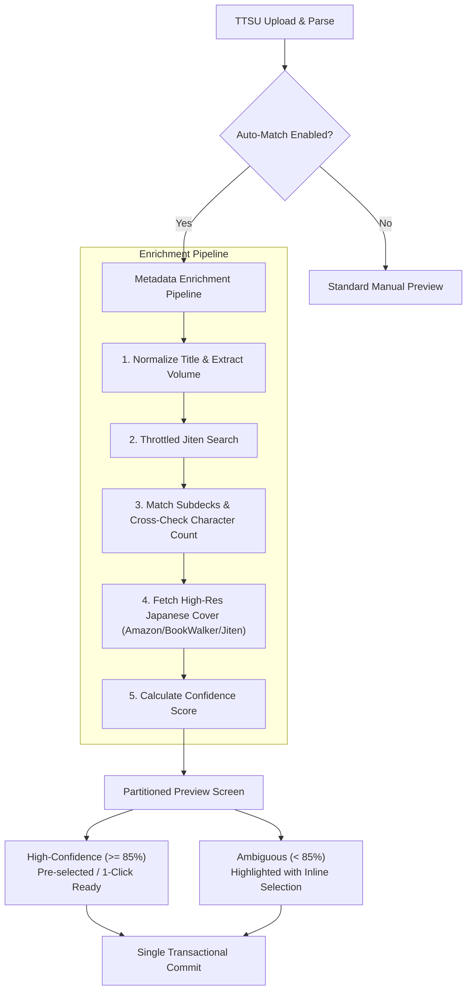

# Automatic Import Mode: Architecture, Rules & Design Specification

This document defines the architectural conventions, matching heuristics, cover-sourcing rules, error-handling models, and UX workflows for the optional **Automatic Import Mode** in Kiseki.

Agents implementing this feature should preserve existing domain invariants, respect database constraints, and follow the specifications outlined below.

---

## 1. System Overview & Objectives

When importing reading history (such as TTSU exports), Kiseki currently relies on a manual review step where users inspect detected books, review daily log reconciliations, and subsequently link works to Jiten or update cover art on a per-work basis.

**Automatic Import Mode** enhances this flow by optionally and automatically:
1. Identifying and matching the imported work to the exact **Jiten deck or subdeck** (volume-level).
2. Fetching and associating an authentic **high-resolution Japanese cover image** (from Amazon JP, BookWalker, or Jiten CDN).
3. Calculating confidence scores to allow **single-click bulk imports** for clean matches while flagging ambiguous entries for brief user confirmation.

---

## 2. UX Models & Recommended Strategy

### Comparison of Approaches

| Model | User Friction | Data Integrity Risk | Error Recovery Cost | Verdict |
| :--- | :--- | :--- | :--- | :--- |
| **1. Fully Automatic** *(Fire-and-forget)* | Zero | **High** | High (silent volume mismatches contaminate character count and reading progress) | Not recommended for initial imports |
| **2. Review Before Import** *(Full manual)* | High | None | Low (every match confirmed individually) | Too tedious for large imports |
| **3. Confidence-Based Hybrid** *(Smart Defaults)* | **Minimal (1 Click)** | **Near Zero** | Minimal (ambiguities presented upfront before write) | **Recommended Standard** |

### The Confidence-Based Hybrid Flow
1. **User Setting**:
   - The TTSU upload view includes an option: `[x] Auto-match metadata & high-res covers` (persisted in local storage/cookie).
2. **Asynchronous Enrichment during Preview**:
   - When the user selects a TTSU folder and submits `OnPostPreviewAsync`, the server parses files, computes log plans, and concurrently triggers the metadata matching pipeline.
3. **Partitioned Review UI**:
   - **Tier 1: High Confidence (>= 85%)**:
     - Visualized with a green status badge (`Auto-Matched`).
     - Pre-populated with the matched Jiten subdeck, inferred book length, and thumbnail cover.
     - Pre-selected for import.
   - **Tier 2: Ambiguous / Low Confidence (< 85%)**:
     - Visualized with an amber badge (`Needs Review`).
     - Explicitly indicates the ambiguity (e.g., *"Matched series '86', but could not verify if Volume 1 or Ep.1 Side Story - please select."*).
     - Inline dropdown/search to resolve in place.
4. **Actionable Confirmation**:
   - If all items are High Confidence, the primary button is: **"Approve & Import All (1 Click)"**.
   - If ambiguous items exist, the user can either quickly resolve them or click **"Import High-Confidence Only"** (leaving ambiguous works created as unbound library items).

---

## 3. Jiten Matching Heuristics & Hierarchy Resolution

### The Hierarchy Challenge
Jiten organizes literature into:
- **Parent Decks (Series)**: High-level franchise entries (e.g. *Sword Art Online*, `childrenDeckCount > 0`).
- **Subdecks (Volumes)**: Specific volumes or installments (e.g. *Sword Art Online Vol. 1*, `parentDeckId != null`).
- **Standalone Decks**: Single one-off books without children (`childrenDeckCount == 0`, `parentDeckId == null`).

> [!IMPORTANT]
> **Strict Invariant**: A volume-level `MediaWork` must **never** be linked to a parent series deck when that parent deck has children subdecks. Doing so assigns the character count of the entire series (e.g., 2,500,000 chars) to a single volume (e.g., 100,000 chars), which corrupts progress calculations.

### Title Parsing & Token Extraction
Raw titles in TTSU exports frequently contain noise, brackets, and irregular volume counters:
- `[Light Novel] 86―エイティシックス― Ep.1`
- `Re:ゼロから始める異世界生活 01`
- `狼と香辛料 I`
- `ダンジョンに出会いを求めるのは間違っているだろうか (14)`
- `ようこそ実力至上主義の教室へ 2年生編 1`

The parsing pipeline must decompose raw strings into:
1. **Normalized Base Title**:
   - Remove release tags: `[Novel]`, `[電撃文庫]`, `(角川スニーカー文庫)`.
   - Strip file extensions: `.epub`, `.html`, `.txt`.
   - Normalize full-width/half-width characters and spaces (NFKC normalization).
2. **Volume / Ordinal Token**:
   - Arabic numerals: `1`, `01`, `14`
   - Roman numerals: `I`, `II`, `IV`, `XIV`
   - Japanese kanji numerals / counters: `第1巻`, `巻の一`, `上`, `中`, `下`
   - Edition / Arc markers: `Ep.1`, `2年生編 1`, `短編集 1`, `Ex`

### Multi-Factor Confidence Scoring Algorithm

| Matching Factor | Heuristic Rule | Score Weight |
| :--- | :--- | :--- |
| **Base Title Match** | Exact match on `OriginalTitle`, `RomajiTitle`, or `EnglishTitle` | **+40%** |
| **Volume Token Match** | Subdeck number or subtitle matches parsed volume token | **+35%** |
| **Character Count Sanity** | TTSU inferred characters match Jiten `characterCount` within ±15% | **+20%** |
| **Chronological Sequence** | Subdeck index corresponds to chronological sequence | **+5%** |

#### Confidence Categories
- **High Confidence (>= 85%)**: Automatic candidate selection accepted without requiring manual intervention.
- **Medium Confidence (60% - 84%)**: Pre-selected, but highlighted for user review.
- **Low Confidence (< 60%)**: No automatic link assigned; manual candidate selection offered.

---

## 4. High-Resolution Cover Sourcing & Quality Rules

### Source Priority Hierarchy
1. **Amazon Japan (`m.media-amazon.com` / `images-na.ssl-images-amazon.com`)**:
   - *Pros*: Highest resolution available (often 1200×1800+), authoritative for Japanese retail bunkobon/tankoubon editions.
   - *Usage*: Query using normalized Japanese title + volume identifier.
2. **BookWalker Japan (`bookwalker.jp`)**:
   - *Pros*: Clean digital cover artwork without physical retail wraps (obi/wrappers).
   - *Usage*: High-quality fallback for digital light novels.
3. **Jiten Moe CDN (`cdn.jiten.moe/covers/...`)**:
   - *Pros*: Directly associated with Jiten deck/subdeck records.
   - *Cons*: Variable scan resolution; subdecks occasionally inherit low-res parent thumbnails.
4. **Fallback**: Kiseki Kanji glyph fallback mark (`本`) or parent series artwork.

### Quality & Selection Invariants
1. **Japanese Language Priority**:
   - Kiseki is a Japanese immersion tracker. **Always prioritize original Japanese domestic covers**.
   - Western/localized covers (e.g., Yen Press, Seven Seas) must be rejected because they frequently alter typography, add western age badges, crop artwork, or merge multiple volumes into omnibuses (breaking volume correspondence).
2. **Aspect Ratio & Dimensions**:
   - Standard vertical book aspect ratio: between **1:1.35** and **1:1.60**.
   - Reject landscape banners, wide wallpapers, square icons, and avatar crops.
   - Minimum acceptable resolution: **600px vertical height**; preferred **1000px+ vertical height**.
3. **URL & Transport Constraints**:
   - Enforce HTTPS protocol.
   - Respect database column constraint: max length **2,048 characters**.
4. **Ambiguity & Missing Artwork Fallback**:
   - Never guess an image from an adjacent volume.
   - If specific volume artwork is unverified, fall back to the parent series cover marked as `(Series Fallback)` or leave unset so the dynamic Japanese character placeholder (`本`) is rendered.

---

## 5. Domain Invariants & Entity Safety

1. **Progress Calculation Hierarchy**:
   - In `MediaWork`:
     ```csharp
     TotalCharacters = ManualCharacterCountOverride ?? TtsuCharacterCount ?? JitenCharacterCount ?? 0;
     ```
   - Automatic Jiten linking populates `JitenCharacterCount`. It must **never** overwrite `ManualCharacterCountOverride` or destroy `TtsuCharacterCount` inferred from bookmarks.
2. **Database Integrity**:
   - Must satisfy check constraint `CK_MediaWorks_JitenSubdeckRequiresDeck`:
     ```sql
     JitenSubdeckId IS NULL OR JitenDeckId IS NOT NULL
     ```
3. **Non-Destructive Re-imports**:
   - If an imported book is already bound to a `MediaWork` (`TtsuBinding`), automatic mode must **never overwrite existing user-customized covers or established Jiten links**.
   - Enrichment applies only to newly created works or works with null/missing links.
4. **Post-Import Reversibility**:
   - Auto-linked works must remain 100% editable post-import via the existing `LinkJiten` and `UpdateCoverUrl` endpoints.

---

## 6. Error Handling & Edge Cases

1. **Rate Limiting & Network Resiliency**:
   - Batch imports may contain 20–100 books. Unthrottled parallel HTTP requests to Jiten or external cover APIs will trigger HTTP 429 (Too Many Requests).
   - *Implementation Rule*: Run external lookups through a throttled queue (maximum 3–5 concurrent requests with exponential backoff and jitter).
   - If Jiten is unavailable or times out, **do not abort the TTSU reading log import**. Reading activity is the primary invariant; metadata enrichment must degrade gracefully to unbound status.
2. **Media Type Disambiguation (Manga vs. Light Novel)**:
   - Franchises frequently have both a Light Novel and Manga adaptation sharing identical titles and volume numbering (e.g. *Re:Zero Vol. 1*).
   - *Heuristic*: Default to `MediaType.Book` (Novel). Cross-reference character counts:
     - Light Novel: Typically 70,000 – 140,000 characters per volume.
     - Manga: Rarely exceeds 5,000 – 15,000 characters per volume.
3. **Fractional & Side-Story Volumes**:
   - Volumes like `4.5`, `Ex 1`, `Short Stories 2`:
   - Frequently indexed differently across database editions.
   - Automatically categorize fractional/special volumes as **Medium Confidence (Requires Review)**.

---

## 7. Recommended Component Architecture

```text
Kiseki.Core/Services/
  ├── Metadata/
  │     ├── IMediaTitleParser.cs         // Cleans titles, extracts volume/ordinal tokens
  │     ├── IJitenMatchService.cs        // Queries Jiten, scores subdeck candidates
  │     ├── ICoverResolutionService.cs   // Resolves high-res covers from Amazon JP / BookWalker / Jiten
  │     └── Models/
  │           ├── ParsedTitleTokens.cs
  │           ├── JitenMatchCandidate.cs
  │           └── CoverCandidate.cs
```

### Proposed Processing Pipeline



