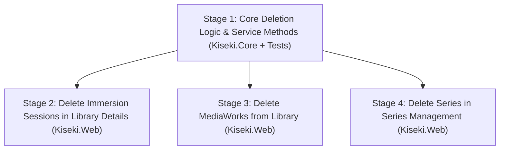

# Deletion Functionality — Implementation Plan

## Overview & Philosophy

Currently, Kiseki allows creating and modifying records, but lacks the ability to delete entities when mistakes happen or when items need cleanup.

This plan introduces clean, safe deletion for three key items:
1. **Immersion Sessions (`ImmersionLog`)**: Delete erroneous or duplicate reading sessions from a book's detail page.
2. **Library Works (`MediaWork`)**: Delete a book from the user's library along with its associated logs and TTSU binding, while gracefully unlinking any series installments.
3. **Series (`MediaSeries`)**: Delete a series and its installment slots, while preserving all underlying library books and reading logs.

---

## Deletion Semantics & Invariants

```text
┌─────────────────────────────────────────────────────────────────────────────┐
│ 1. Delete ImmersionLog                                                      │
│    - Removes the specific ImmersionLog record.                              │
│    - MediaWork.CurrentCharactersRead dynamically decreases.                 │
│    - Series progress dynamically decreases.                                 │
│    - MediaWork remains in library.                                          │
└─────────────────────────────────────────────────────────────────────────────┘

┌─────────────────────────────────────────────────────────────────────────────┐
│ 2. Delete MediaWork                                                         │
│    - Removes the MediaWork record.                                          │
│    - Removes all associated ImmersionLogs.                                  │
│    - Removes associated TtsuBinding (if imported from TTSU).                │
│    - Any SeriesInstallment linked to this work is UNLINKED (MediaWorkId     │
│      set to null); the installment slot itself and its Jiten metadata       │
│      remain preserved.                                                      │
└─────────────────────────────────────────────────────────────────────────────┘

┌─────────────────────────────────────────────────────────────────────────────┐
│ 3. Delete MediaSeries                                                       │
│    - Removes the MediaSeries record.                                        │
│    - Cascade deletes all SeriesInstallments for this series.                │
│    - Preserves all linked MediaWorks in the library (work.MediaSeriesId     │
│      is set to null).                                                       │
│    - Preserves all immersion sessions, bookmarks, and reading history.       │
└─────────────────────────────────────────────────────────────────────────────┘
```

---

## Roadmap & Stages



---

### Stage 1: Core Deletion Logic & Service Methods (`Kiseki.Core` + `Kiseki.Tests`)

**Goal**: Implement and test robust deletion methods in `Kiseki.Core` ensuring all database constraints, foreign keys, and relationship cleanups are satisfied.

1. **Series Deletion (`ISeriesService` / `SeriesService`)**:
   - Add `Task DeleteSeriesAsync(Guid seriesId, CancellationToken cancellationToken = default);`:
     - Loads series with installments.
     - Unlinks any `MediaWork` that references `seriesId` (`work.MediaSeriesId = null`).
     - Removes installments (`SeriesInstallments`).
     - Removes the `MediaSeries`.
     - Commits transaction.
2. **Library Work Deletion Service (`ILibraryManagementService` or companion in `Kiseki.Core`)**:
   - Provide a safe method for deleting a `MediaWork`:
     - Unlinks any `SeriesInstallment` referencing this work.
     - Deletes all `ImmersionLogs` for this work (preventing foreign key constraint violations on `TtsuBinding`).
     - Removes `TtsuBinding` if present.
     - Removes `MediaWork`.
     - Commits transaction.
3. **Session Deletion**:
   - Provide deletion logic for an `ImmersionLog` by ID, validating that it belongs to the target work.
4. **Unit Tests (`Kiseki.Tests`)**:
   - Test deleting series: verify series & installments are removed, but linked `MediaWork` items remain intact with `MediaSeriesId = null`.
   - Test deleting work: verify work, binding, and logs are removed, and any linked series installment has its `MediaWorkId` set to `null`.
   - Test deleting session: verify log is removed and characters read decreases.

---

### Stage 2: Delete Immersion Sessions (`/Library/Details/{id}`)

**Goal**: Allow users to delete individual reading sessions directly from the Sessions table on a book's detail page.

1. **PageModel Handler (`Library/Details.cshtml.cs`)**:
   - Add `OnPostDeleteSessionAsync(Guid id, Guid logId)`:
     - Validates that the log exists and belongs to the specified work.
     - Deletes the log and saves changes.
     - Supports both standard POST redirect (PRG with `TempData["LibraryNotice"]`) and AJAX JSON for seamless deletion.
2. **UI Markup (`Library/Details.cshtml`)**:
   - Add an **Action** column to the Sessions table with a trash icon / delete button.
   - Include a confirmation dialog (`onsubmit="return confirm('Delete this immersion session?');"`).
3. **Styling (`site.css`)**:
   - Style the session delete button with subtle hover states matching the dark theme.
4. **Tests (`LibraryDetailsPageTests.cs`)**:
   - Verify deleting a session reduces `work.Logs.Count` and recomputes `CharactersRead`.

---

### Stage 3: Delete MediaWorks (`/Library/Details/{id}`)

**Goal**: Allow users to remove a book completely from their library with a safe confirmation flow.

1. **PageModel Handler (`Library/Details.cshtml.cs`)**:
   - Add `OnPostDeleteWorkAsync(Guid id)`:
     - Deletes the book, its logs, and its binding.
     - Unlinks any series installments.
     - Redirects to `/Library/Index` with `TempData["LibraryNotice"] = "Deleted '{Title}' from library."`.
2. **UI Markup (`Library/Details.cshtml`)**:
   - Add a **"Danger Zone"** section at the bottom of the details page (or in the metadata aside):
     - Red/subtle outline "Delete from library" button.
     - Confirmation modal / alert dialog warning that all reading history for this volume will be deleted.
3. **Tests (`LibraryDetailsPageTests.cs`)**:
   - Test `OnPostDeleteWorkAsync` verifies database cleanup and redirect to `/Library/Index`.

---

### Stage 4: Delete Series (`/Series/Details/{id}` & `/Series/Index`)

**Goal**: Allow users to delete a series container without losing any books or reading history.

1. **PageModel Handler (`Series/Details.cshtml.cs`)**:
   - Add `OnPostDeleteSeriesAsync(Guid id)`:
     - Calls `_seriesService.DeleteSeriesAsync(id)`.
     - Redirects to `/Series/Index` with `TempData["SeriesNotice"] = "Deleted series '{Title}'."`.
2. **UI Markup (`Series/Details.cshtml`)**:
   - Add a "Delete series" button in the page header actions or a danger zone card.
   - Clear confirmation message explaining: *"This will remove the series and its volume slots. Your library books and reading logs will not be deleted."*
3. **Optional UI (`Series/Index.cshtml`)**:
   - Add quick delete option on the series card or overflow menu.
4. **Tests (`SeriesDetailsPageTests.cs` & `SeriesIndexPageTests.cs`)**:
   - Verify deleting a series unlinks books, removes series and installments, and sets flash notice.

---

## Review & Approval Gate

Once you review and approve this plan, we will create `docs/delete-functionality-progress.md` and begin with **Stage 1: Core Deletion Logic & Service Methods**.
