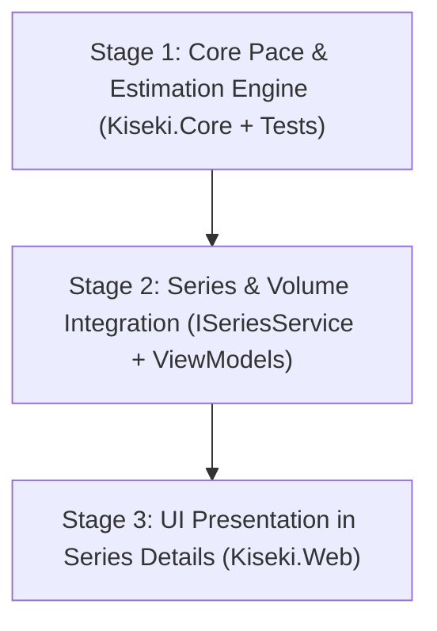

# Series Reading Time Estimation — Implementation Plan

## Overview & Goals

This plan defines the architecture, calculation models, and UI changes to show **estimated time remaining** for a series and its individual volumes on the **Series Details** screen (`/Series/Details/{id}`).

The feature will display:
1. **Both** time perspectives:
   - **Calendar Time**: Real-world completion timeline (e.g., `~1 mo 12 d`, `~3 weeks`, `~4 days`) based on daily reading habits.
   - **Immersion Reading Time**: Pure reading time (e.g., `38h 20m`, `5h 10m`) based on reading speed.
2. **Rolling 30-Day Average with Fallback**:
   - Calculates speed (characters/hour) and daily pace (characters/calendar day) from the user's last 30 days of immersion logs.
   - Automatically falls back to the user's all-time library average if recent activity is insufficient.
3. **Dual-Level Visibility**:
   - **Series-level**: Primary estimate on the Series Details header stat grid.
   - **Volume-level**: Individual remaining time estimate on each installment item in the volume list.

---

## Architectural Principles (Following `AGENTS.md`)

- **Domain Logic in Core**: All speed, pace, and time remaining calculations live in `Kiseki.Core`. Razor pages and view models only format and display.
- **Incremental Stages**: Implement in self-contained stages with test verification at each step.
- **Graceful Degradation**: If character counts are missing, or if the user has no immersion logs with time, the UI shows clear, non-intrusive fallback messaging rather than failing or displaying `0h` or `NaN`.

---

## Mathematical & Calculation Models

### 1. Speed & Pace Calculation (`ReadingPaceProfile`)

```text
ImmersionLogs (Last 30 Days)
  ├── TotalCharacters = Sum(CharactersRead)
  └── TotalMinutes = Sum(TimeSpentMinutes)

Speed (ch/h) = TotalCharacters / (TotalMinutes / 60)
Daily Pace (ch/day) = TotalCharacters / 30.0
Daily Time Pace (minutes/day) = TotalMinutes / 30.0
```

#### Fallback Rules:
- If the last 30 days have fewer than **60 minutes** of logged reading or **0 characters**, query **all-time** logs instead.
- If all-time logs also have no valid time data, pace is marked as `Unavailable`.

### 2. Series & Volume Remaining Characters

For each installment:
- **Completed** (`IsCompleted == true`): Remaining characters = `0`.
- **In Progress**: Remaining characters = `Math.Max(0, EffectiveTotalCharacters - EffectiveCharactersRead)`.
- **Unread**: Remaining characters = `EffectiveTotalCharacters`.
- **Unknown length** (`EffectiveTotalCharacters == 0`): Remaining characters = `0` (flagged as uncounted).

Series Remaining Characters:
$$\text{RemainingCharacters} = \sum \text{Installment Remaining Characters}$$

### 3. Time Remaining Derivations (`ReadingTimeEstimate`)

$$\text{ReadingHours} = \frac{\text{RemainingCharacters}}{\text{Speed (ch/h)}}$$

$$\text{CalendarDays} = \frac{\text{RemainingCharacters}}{\text{Daily Pace (ch/day)}}$$

#### Formatting Guidelines:
- **Calendar Duration**:
  - `< 1 day`: `"Today"` or `"< 1 day"`
  - `< 14 days`: `"{days} days"`
  - `14 - 60 days`: `"{weeks} w {days} d"` or `"{days} days"`
  - `> 60 days`: `"{months} mo {days} d"`
  - `> 365 days`: `"{years} yr {months} mo"`
- **Immersion Reading Time**:
  - `< 1 hour`: `"{minutes}m reading"`
  - `1 - 24 hours`: `"{hours}h {minutes:D2}m reading"`
  - `> 24 hours`: `"{hours}h reading"`

---

## Roadmap & Stages



---

### Stage 1: Core Pace & Estimation Engine

**Goal**: Build pure domain models and calculation services in `Kiseki.Core` with complete unit test coverage.

1. **Domain Models** (`Kiseki.Core/Models/` or `Entities/`):
   - `ReadingPaceProfile`:
     - `int CharactersPerHour`
     - `int DailyCharacters`
     - `double DailyMinutes`
     - `ReadingPaceSource` (`Recent30Days`, `AllTime`, `Unavailable`)
     - `int SampleDays`
     - `int LogCount`
   - `ReadingTimeEstimate`:
     - `int RemainingCharacters`
     - `TimeSpan ReadingTime`
     - `double CalendarDays`
     - `string FormattedReadingTime` (e.g. `"38h 20m"`)
     - `string FormattedCalendarTime` (e.g. `"~1 mo 12 d"`)
     - `bool IsCompleted`
     - `bool HasSufficientData`
     - `bool HasUncountedVolumes`
2. **Pace Calculation Logic**:
   - Create `IReadingPaceService` / `ReadingPaceCalculator` in `Kiseki.Core.Services`:
     - `GetPaceProfileAsync(CancellationToken)`: Queries `ImmersionLogs` for recent 30-day activity, applying outlier filtering (`TimeSpentMinutes > 0`, `CharactersRead > 0`), with fallback to all-time.
     - `EstimateTime(int remainingCharacters, ReadingPaceProfile pace, bool isCompleted = false)`: Computes time spans and formatted strings.
     - `FormatCalendarDuration(double days)` and `FormatReadingTime(TimeSpan time)`.
3. **Tests** (`Kiseki.Tests`):
   - Unit tests covering:
     - Rolling 30-day speed & pace calculations.
     - Fallback to all-time when recent logs are below threshold.
     - Edge cases: 0 logs, 0 minutes, speed calculation with rest days.
     - Time estimate calculations: 100% complete (0 time), partial progress, uncounted items.
     - String formatters across various day/hour ranges.

---

### Stage 2: Service & ViewModel Integration

**Goal**: Wire the pace estimator into series loading so both the series aggregate and each individual installment carry calculated estimates.

1. **Service Integration** (`Kiseki.Core.Services.ISeriesService` / `SeriesService`):
   - Enhance series details fetching to load the user's pace profile.
   - Alternatively, inject `IReadingPaceService` into `Series/Details.cshtml.cs` so series details and user pace can be composed cleanly without bloating entity objects.
2. **ViewModel Updates** (`Kiseki.Web.Models`):
   - `SeriesInstallmentViewModel`:
     - Add `ReadingTimeEstimate? TimeEstimate`
     - Add `int RemainingCharacters => IsCompleted ? 0 : Math.Max(0, EffectiveTotalCharacters - EffectiveCharactersRead)`
   - `SeriesDetailsViewModel`:
     - Add `ReadingTimeEstimate? TimeEstimate`
     - Add `ReadingPaceProfile? PaceProfile`
     - Add `int RemainingCharacters`
     - Add `int UncountedInstallmentsCount`
3. **PageModel Updates** (`Kiseki.Web/Pages/Series/Details.cshtml.cs`):
   - In `LoadSeriesAsync`, compute estimates for the series and each installment using the retrieved pace profile.
4. **Tests** (`Kiseki.Tests`):
   - PageModel and service integration tests verifying that `SeriesDetailsViewModel` has populated estimates for both the series and its installments.

---

### Stage 3: UI Presentation in Series Details Page

**Goal**: Deliver a polished, responsive, dark-mode UI for both series-level and volume-level estimates.

1. **Series Header Overview Grid** (`Pages/Series/Details.cshtml`):
   - Add an **"Est. time left"** tile to the `.detail-stat-grid`:
     - Primary line: Calendar time (e.g. `~1 mo 12 d`)
     - Secondary line / badge: Immersion reading time (e.g. `38h reading`)
     - Subtext / tooltip: Pace context (e.g. `Based on ~18,200 ch/h (45 min/day) over last 30 days`)
   - Empty/fallback states:
     - Series completed: Shows `Completed` with checkmark.
     - No reading logs with time: `Log reading time to estimate`.
     - Some volumes missing counts: Note like `(3 volumes uncounted)`.
2. **Installments List** (`Pages/Series/Details.cshtml`):
   - Add volume-level time remaining badge/label next to the progress bar in `.series-installment-progress` or `.series-installment-meta`:
     - If completed: Shows `Done` or checkmark.
     - If in progress: Shows `~2h 15m left (1 d)`.
     - If unread: Shows `~6h 30m (4 d)`.
     - If character count is not set: Shows `--`.
3. **Styling & Visual Polish** (`Kiseki.Web/wwwroot/css/site.css`):
   - Style time estimate badges and subtitles using existing theme variables (`var(--color-text-secondary)`, `var(--color-edge)`).
   - Ensure clean wrapping on mobile/narrow viewports.
4. **Verification**:
   - Run complete test suite (`dotnet test`).
   - Validate visual rendering.

---

## Review & Approval Gate

Once you review and approve this implementation plan, we will begin with **Stage 1: Core Pace & Estimation Engine**.
